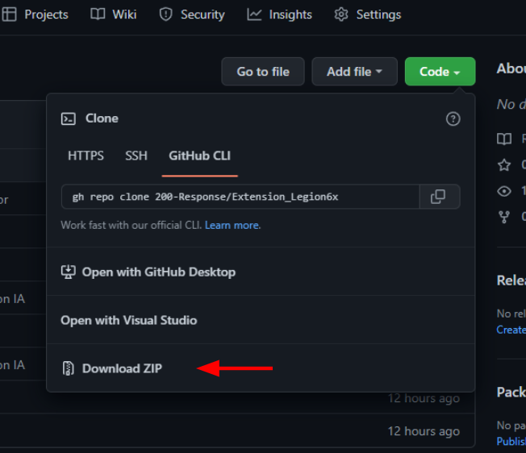
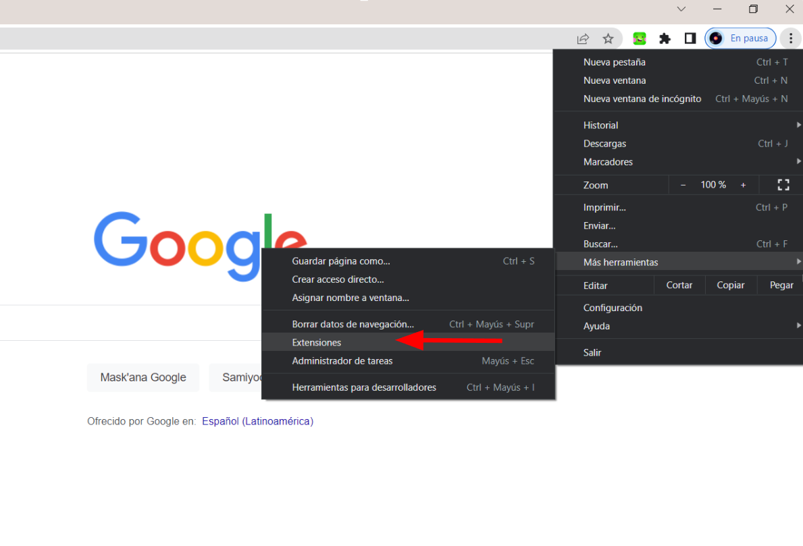
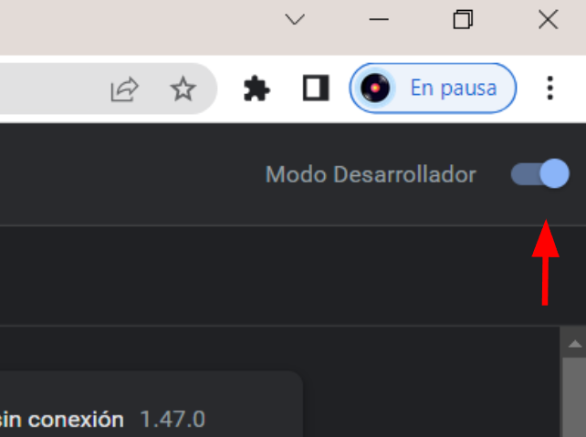
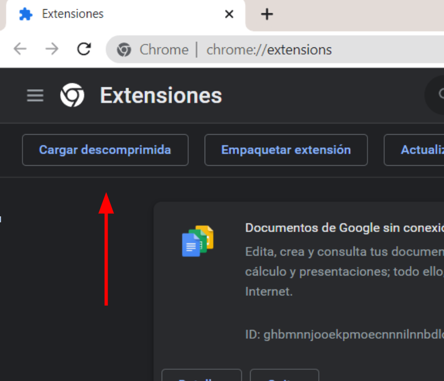
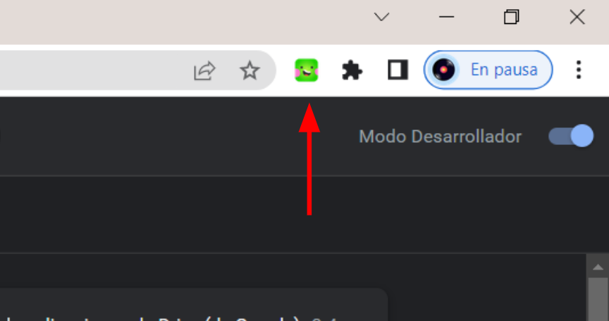

# Extensión DEICAN Legion-6x
 

## - IMPORTANTE -  La extensión se diseñó con tecnología Google Chrome de preferencia mayor de 106 versión. No es posible en Firefox ni Edge
 

### Introducción de instalación

- Ubicación de lugar descarga, podrás descargar la extensión DEICAN en
  Code -> Download ZIP

 
 
 

- Abrir el menú de extensión del navegador

 
 
 

- Activar el "Modo Desarrollador" del navegador

 
 
 

- Cargar descomprimida de la extensión DEICAN

 
 
 

- Finalmente, podras darle clic a la extensión DEICAN

 
 
 
